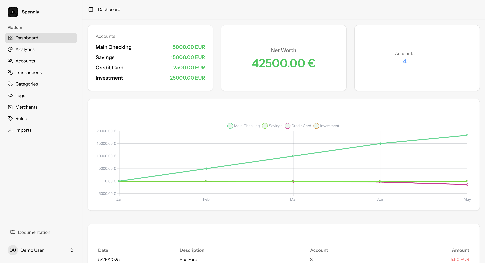
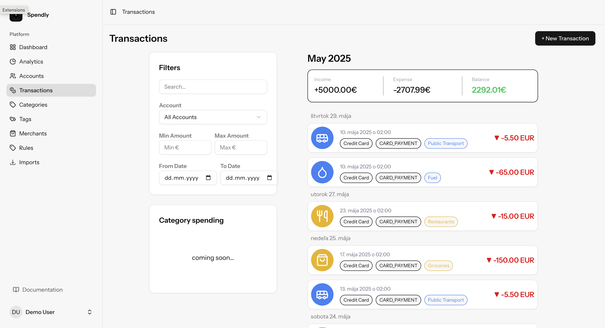
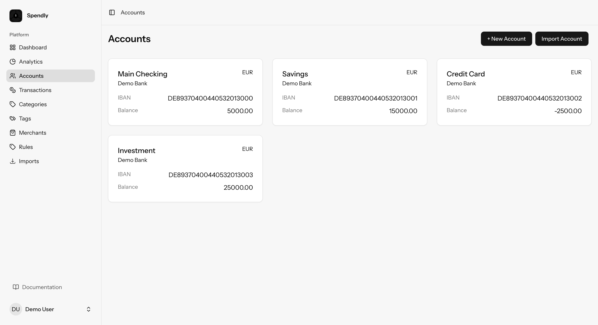
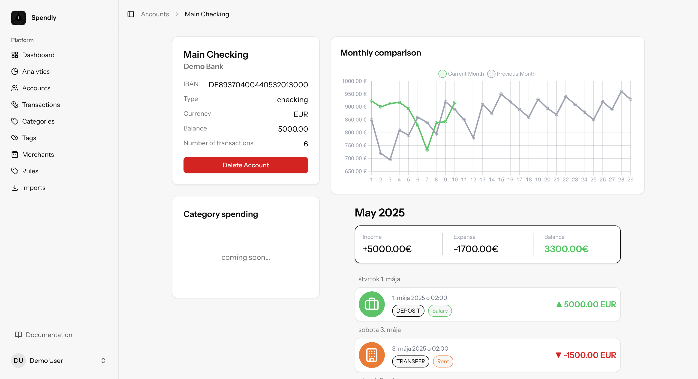
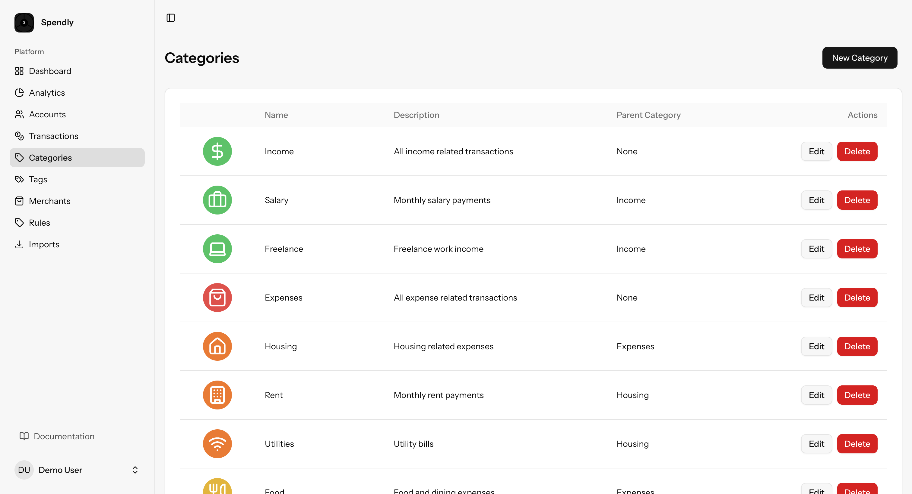
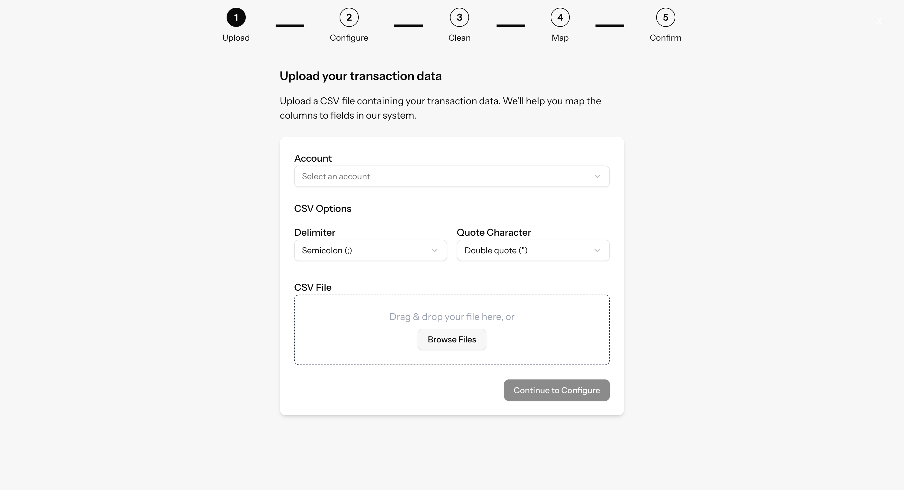

# Spendly - Personal Finance Tracker

[](https://opensource.org/licenses/MIT)
[](https://laravel.com)
[](https://reactjs.org)

> ⚠️ **Pre-release Version Notice**
> 
> This is a pre-release version of Spendly. The application is currently in active development and many features are still being implemented. The codebase was built with significant AI assistance and requires refactoring for production use. Use at your own risk and feel free to contribute to its development.


Spendly is an open-source personal finance tracker that helps you manage your finances, analyze spending patterns, and maintain budgets. It integrates with GoCardless for seamless bank account imports and provides powerful financial analysis tools.

## 📸 Screenshots

<div style="display: grid; grid-template-columns: repeat(2, 1fr); gap: 20px;">
    
    
    
    
    
    
</div>

## 🌟 Features

- **Bank Account Integration**: Import transactions automatically using GoCardless
- **Financial Analysis**: Get insights into your spending patterns and financial health
- **Budget Management**: Create and track budgets for different categories
- **Transaction Categorization**: Automatically categorize transactions with machine learning
- **Reports & Visualizations**: Beautiful charts and reports for better financial understanding
- **Multi-currency Support**: Track finances in multiple currencies
- **Secure**: Bank-level security for your financial data
- **CSV Import**: Import transactions from CSV files with customizable field mapping


## 🚀 Tech Stack

- **Backend**: Laravel 10.x
- **Frontend**: React 18.x
- **Database**: MySQL/PostgreSQL
- **Authentication**: Laravel Sanctum
- **API Integration**: GoCardless API
- **Testing**: PHPUnit, Jest

## 🐳 Quick Start

1. Clone the repository:
```bash
git clone https://github.com/yourusername/spendly.git
cd spendly
```

2. Copy the environment file:
```bash
cp .env.example .env
```

3. Configure your environment variables in `.env`:
```
DB_CONNECTION=mysql
DB_HOST=mysql
DB_PORT=3306
DB_DATABASE=spendly
DB_USERNAME=root
DB_PASSWORD=secret

GOCARDLESS_ACCESS_TOKEN=your_access_token
GOCARDLESS_ENVIRONMENT=sandbox
```


4. Start the application:
```bash
docker compose up -d
```


The application will be available at:
- http://localhost:80

For detailed development setup and contribution guidelines, please see [Development Guide](docs/Development.md).

## 📄 License

This project is licensed under the MIT License - see the [LICENSE](LICENSE) file for details.

## 🙏 Acknowledgments

- [Laravel](https://laravel.com)
- [React](https://reactjs.org)
- [GoCardless](https://gocardless.com)
- All our contributors and supporters

## 📞 Support

- [GitHub Issues](https://github.com/yourusername/spendly/issues)
- [Discord Community](https://discord.gg/spendly)
- [Documentation](https://docs.spendly.app)

## 🔗 Links

- [Website](https://spendly.app)
- [Blog](https://blog.spendly.app)
- [Twitter](https://twitter.com/spendly)
- [LinkedIn](https://linkedin.com/company/spendly)
